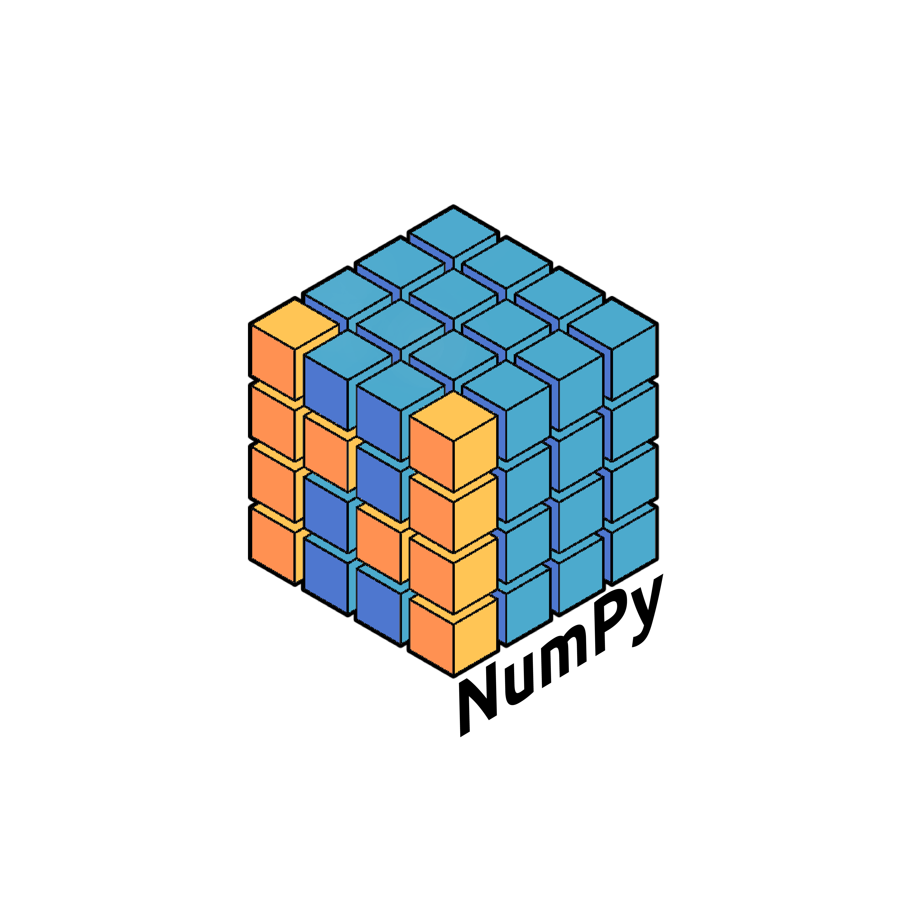
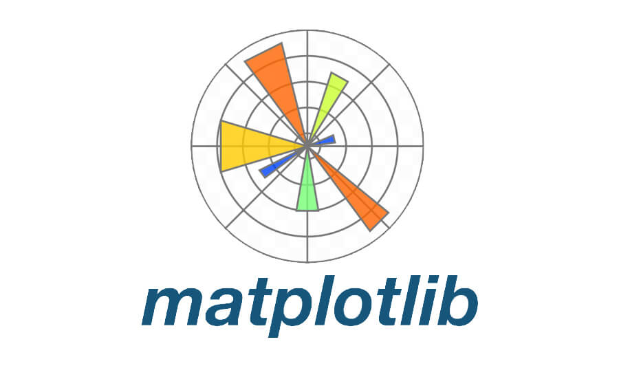
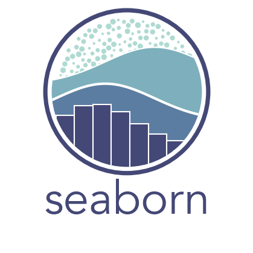

## <b> Привет всем! 👋 
 Добро пожаловать на мой Git! </b> 💥 💥 💥 
### <b>Меня зовут Алина и я: </b>

💻 люблю работать с данными и программировать  
📈 готова узнавать все новое и считаю, что саморазвитие это круто  
🎓 окончила Karpov.Courses по направлениям Аналитик данных и Машинное обучение  
💡 развиваю свои навыки на степике и симуляторах 

<b> Некоторые свои проекты представляю на github 🌟 </b> 

## 📚 <b> Мои проекты </b> 

> <a href="https://github.com/AlinAli16/Karpov.Courses/tree/main/karpov.courses_da">My проекты на Karpov.Courses по направлению Аналитик данных </a>

<ul>
 📁 Промежуточный проект по  e-commerce на Karpov.Courses <a href="https://github.com/AlinAli16/Karpov.Courses/tree/main/karpov.courses_da/e-commerce"> здесь </a>  
 📁 Финальный проект на Karpov.Courses <a href="https://github.com/AlinAli16/Karpov.Courses/tree/main/karpov.courses_da/final_project">здесь</a>  
 📁 Другие проекты <a href="https://github.com/AlinAli16/Karpov.Courses/tree/main/karpov.courses_da/other">здесь</a>
     <ul> 
      📑 <a href="https://github.com/AlinAli16/Karpov.Courses/tree/main/karpov.courses_da/other/AA_test">A/A тестирование </a>  
      📑 <a href="https://github.com/AlinAli16/Karpov.Courses/tree/main/karpov.courses_da/other/AB_test"> A/B тестирование </a>  
      📑 <a href="https://github.com/AlinAli16/Karpov.Courses/tree/main/karpov.courses_da/other/ETL(Python%2BSQL)"> ETL (Python + SQL) </a>  
      📑 <a href="https://github.com/AlinAli16/Karpov.Courses/tree/main/karpov.courses_da/other/airflow_python"> Airflow </a>   
     </ul>
</ul>

> <a href="https://github.com/AlinAli16/Karpov.Courses/tree/main/karpov.courses_ml">My проекты на Karpov.Courses по направлению Start ML </a>

<ul>
 📁 Прикладная разработка на Python <a href="https://github.com/AlinAli16/Karpov.Courses/tree/main/karpov.courses_ml/Python">здесь</a>
</ul>

## 🛠️ <b> Мой стек </b> 
 
 
 

 
 

 
 
 
 

