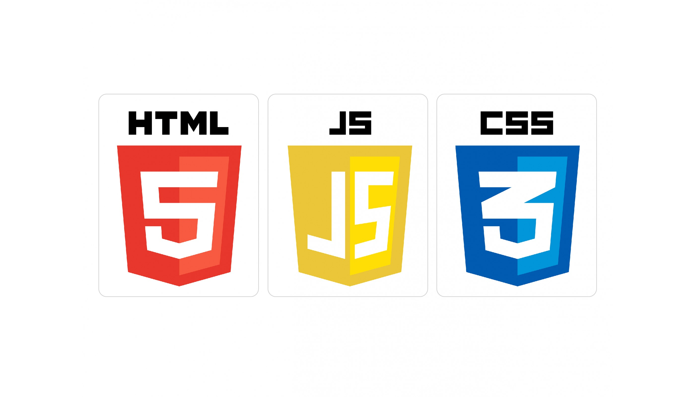

##  <b> Привет всем! 👋 
 Добро пожаловать на мой Git! </b> 💥 💥 💥 
### Меня зовут Алина и, я считаю, что саморазвитие это круто! Сама я люблю учится и узнавать все новое. Некоторые свои результаты я представляю в github. Чем я могу похвастаться?

### 🎓 Окончила технический вуз с отличием и получила грамоту за успехи в научной деятельности и участие в конференциях для студентов и аспирантов
  <ul> Посвятила диплом математическому моделированию и статистическому анализу помехоустойчивого кодирования с использованием математики полей Галуа и реализовала алгоритм кодирование/декодирования в Matlab
   </ul>

### 🎓 Окончила Karpov.Courses по направлению Аналитик данных: 

  <ul> 
     <li> Освоила Python для анализа и визуализации данных с ипользованием библиотек Pandas, Numpy, Scipy, Matplotlib, Seaborn e.t.c. </li>
     <li> Рассмотрела основы математической статистики, теорию вероятности и формирование статистических гипотез, основные тесты и методы для их проверки </li>
     <li>Работала с базами данных SQL Clickhouse и PostgreSQL </li>
     <li> Занималась визуализацией данных в Tableau, Redash </li> 
     <li> Проводила расчет основных продуктовых метрик </li>
     <li> Проводила A/A и A/B тестирвоание </li>
     <li> Использовала инструменты для планирования и мониторинга процессов Cron и Airflow </li>
   </ul>

### 🎓 Развиваю свои навыки на степике 

  <ul> <li>На данный момент погружаюсь глубже в базы данных и аналитику с помощью sql и python </li>
   </ul>

## 📚  <b> Мои проекты </b>

> <a href="https://github.com/AlinAli16/karpov.courses" title="Результаты курса">My work on Karpov.Courses </a>

<ul>
 📁 Промежуточный проект по  e-commerce на Karpov.Courses <a href="https://github.com/AlinAli16/karpov.courses/tree/main/e-commerce"> здесь </a>  
 📁 Финальный проект на Karpov.Courses <a href="https://github.com/AlinAli16/karpov.courses/tree/main/final_project">здесь</a>  
 📁 Другие проекты <a href="https://github.com/AlinAli16/karpov.courses/tree/main/other">здесь</a>
</ul>

> <a href="https://github.com/AlinAli16/Stepik" title ="Результаты со степика">Моя работа на Stepik </a>

<ul>
 📁 Python  
 📁 Web (скоро) 
</ul>

## 🛠️  <b> Мой стек </b>
 
 
 

 
 

 
 
 
 

